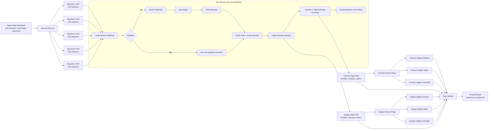

# Multi-Machine Session Cycle

This flow runs a mock election with:

- 5 polling-place machine services
- 100 voter sessions per machine (500 total sessions)
- Random spoiled sessions
- Per-session machine reset
- End-of-run integrity verification across airgap + central ingest and ledger nodes



### Text fallback

```text
generate sessions -> run per machine -> cast workflow -> export bundle
-> airgap ingest -> central ingest -> relays -> ledgers -> verifier
```

## Verification signals

- `ingest_bundles` count equals total sessions (`500`).
- `ingest_receipts` count equals non-spoiled sessions.
- Airgap and central `anchor_outbox` pending counts are both `0`.
- Airgap and central ledger latest index on all three nodes are each equal and at least bundle count.
- Airgap and central ledger latest hash on all three nodes are each identical.
- Cast/verify success count equals non-spoiled sessions.
